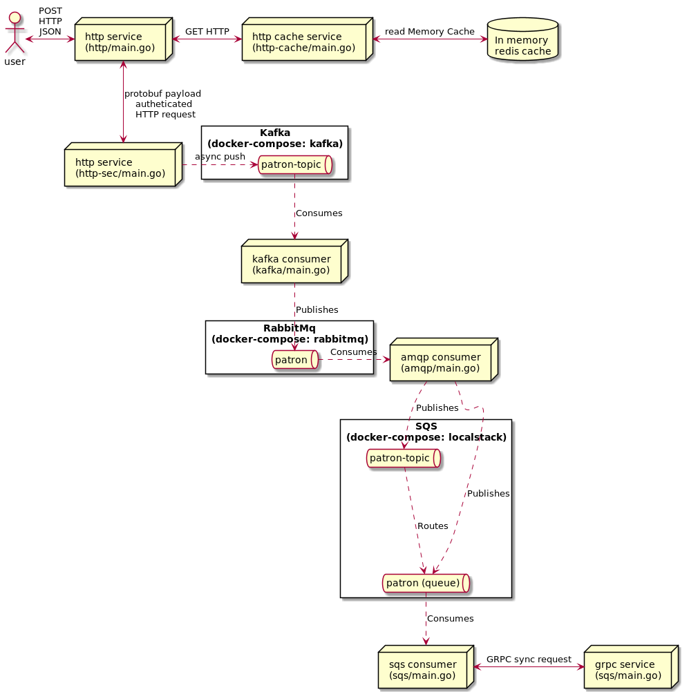

# Examples

The [examples/](/examples) folder contains a number of small services which work together to provide an overview of Patron's clients and components, as well as the built-in tracing and logging. After you start them all, you can see how a request travels through all services by triggering the `start_processing.sh` script.

## Prerequisites

To run these examples on your system, you need the following dependencies installed:

* [Docker](https://www.docker.com/)
* [Docker compose](https://docs.docker.com/compose/install/)
* [Golang](https://golang.org/)
* [Bash shell](https://www.gnu.org/software/bash/)
* [curl](https://curl.se/)

Before all services start we should first start all dependencies (e.g. kafka, postgres, jaeger, rabbitmq, redis, etc...) with `docker-compose`. 

```shell
docker-compose up -d
```

To tear down the above just:

```shell
docker-compose down
```

Next up, we will start several services that connect to each other as a chain using different communication
stacks. All [patron services](Architecture.md#Service) start an HTTP component exposing 'liveness', 'readiness', 'metrics' and 'debugging'
endpoints, therefore, all the following 'microservices' use different ports in order to avoid collisions.
Below you can find a simplified view of the communication between the services:

[comment]: <> (image is the result of the plantuml diagram with the same name)


## [HTTP Cache Service](../examples/http-cache/main.go) 

The service shows how to use:
 
- HTTP caching in a specific route using Redis
- Textual logger 
  
The service can be started as follows:

```shell
go run examples/http-cache/main.go
```

## [HTTP Service](../examples/http/main.go)

The service shows how to use:

- File HTTP server
- HTTP with CORS
- HTTP client with API key
- Textual logger with predefined fields
  
The service can be started as follows:

```shell
go run examples/http/main.go
```

## [HTTP API Key Service](../examples/http-sec/main.go)

- HTTP service with a secured route (API KEY)
- Async Kafka publisher
- Default structured logger with predefined fields

The service can be started as follows:

```shell
go run examples/http-sec/main.go
```

## [Kafka Service](../examples/kafka/main.go)

---
**NOTE**

Use either this service or the [Legacy Kafka Service](../examples/kafka-legacy/main.go).
They collide in the served port configuration and therefore cannot coexist.

---
The service shows how to use:

- Kafka with a group consumer
- AMQP publisher
- Textual logger

The service can be started as follows:

```shell
go run examples/kafka/main.go
```

## [Legacy Kafka Service](../examples/kafka-legacy/main.go)

---
**NOTE**

Use either this service or the [Kafka Service](../examples/kafka/main.go).
They collide in the served port configuration and therefore cannot coexist.

---

The service shows how to use:

- Kafka with a group consumer
- AMQP publisher
- Textual logger

The service can be started as follows:

```shell
go run examples/kafka-legacy/main.go
```

## [AMQP Service](../examples/amqp/main.go)

The service shows how to use:

- AMQP consumer
- AWS SNS Publisher
- AWS SQS Publisher
- Default structured logger

The service can be started as follows:

```shell
go run examples/amqp/main.go
```

## [AWS SQS Service](../examples/sqs/main.go)

The service shows how to use:

- AWS SQS Consumer
- gRPC client
- Default structured logger

The service can be started as follows:

```shell
go run examples/sqs/main.go
```

## [AWS SQS Concurrent Service](../examples/sqs-simple/main.go)

The service shows how to use:

- AWS SQS Concurrent Consumer
- Default structured logger

The service can be started as follows:

```shell
go run examples/sqs-simple/main.go
```

## [gRPC Service](../examples/grpc/main.go)

The service shows how to use:

- gRPC Server
- Textual logger

The service can be started as follows:

```shell
go run examples/grpc/main.go
```

## All the above working together

After all services have been started successfully we can send a request and see how it travels through all of them by running. 

```shell
../examples/start_processing.sh
```

After that head over to [jaeger](http://localhost:16686/search) and [prometheus](http://localhost:9090/graph).

## Taking a shortcut:

You can see that the `examples` folder contains also a `Makefile`. Instead of executing all the above-mentioned commands
yourself you could also simply change your directory to the `examples` folder and run:

```bash
$ make
```

By doing that you will start the infrastructure containers, start the example services with their logs redirected 
to `examples/tmp/log` (there you can check if any of the services fail to start). 

```bash
$ ls -1 examples/tmp/log/*
examples/tmp/log/http-amqp-svc.log
examples/tmp/log/http-cache-svc.log
examples/tmp/log/http-grpc-svc.log
examples/tmp/log/http-kafka-svc.log
examples/tmp/log/http-sec-svc.log
examples/tmp/log/http-sqs-svc.log
examples/tmp/log/http-svc.log
```

You will also find a file under `examples/tmp/pid.txt` which is a repository of the pids of your services:

```bash
$ cat examples/tmp/pid.txt 
27733|http-cache-svc
28920|http-svc
29738|http-sec-svc
29875|http-kafka-svc
30047|http-amqp-svc
30191|http-sqs-svc
30315|http-grpc-svc
```

## [Compression Middleware](../examples/compression-middleware)
The compression-middleware example showcases the compression middleware with a /foo route that returns some random data.
```shell
$ go run examples/compression-middleware/main.go 
$ curl -s localhost:50000/foo | wc -c
1398106
$ curl -s localhost:50000/foo -H "Accept-Encoding: nonexisting" | wc -c
1398106
$ curl -s localhost:50000/foo -H "Accept-Encoding: gzip" | wc -c
1053068
$ curl -s localhost:50000/foo -H "Accept-Encoding: deflate" | wc -c
1053045
```

It also contains a /hello route used by the next example

## [Client Decompression](../examples/client-decompression)
After launching the `compression-middleware` example, you can run the following to validate that Patron's HTTP client
handles compressed requests transparently. 

It creates three requests (with and without an 'Accept-Encoding' header), where you can
see that the response from the previous example is decompressed automatically.

```shell
go run examples/client-decompression/main.go
```
